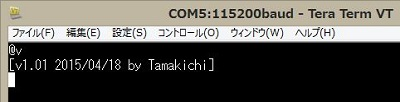
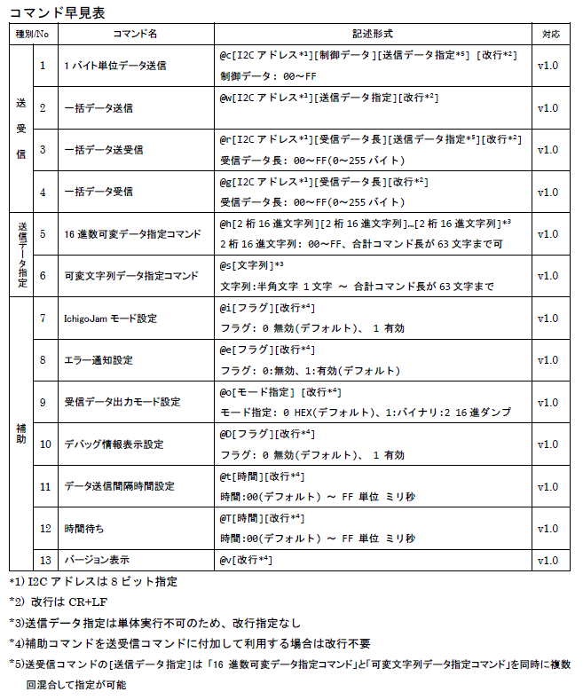
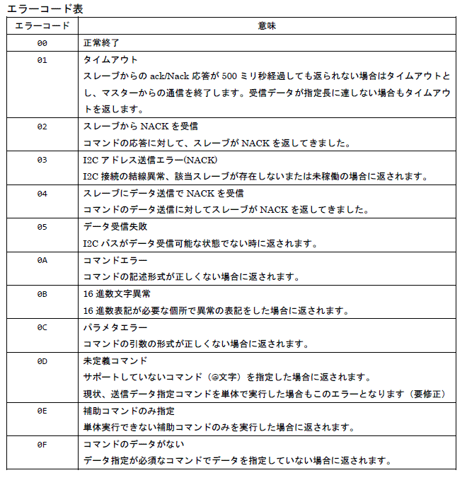
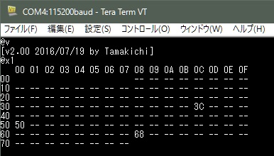
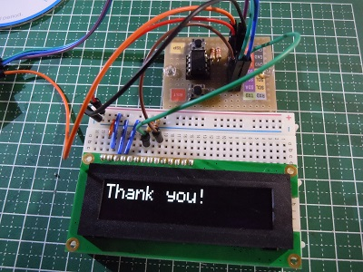
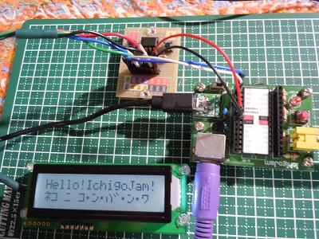
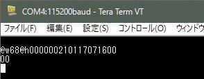
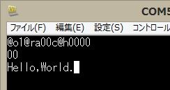

# LPC810 UART-I2Cブリッジモジュール  
     
##概要  
シリアル通信(UART)でI2C接続機器(I2Cスレーブ)を制御するためのモジュールです。  
制御用に8ピンDIPマイコン(通称 どんぐり) LPC810を利用してます。 

##特徴  
- UART経由で簡易コマンドを使ってI2Cスレーブへのデータ送信および受信を行うことが出来ます。  
- 送信するデータは可変長バイトデータ、および可変長半角文字列データに対応しています。  
- 受信データの出力はHEX形式、バイナリー形式、ダンプ表示（デバッグ用）を指定出来ます。  
- I2Cバスに接続しているI2Cデバイスを調べてそのデバイスのアドレスを表示する機能を有します。  

##ハードウェア  
**回路図**  
  
VCCは3.3Vです。  
SDA、SCLは内部プルアップ抵抗を利用しています。  

**利用部品**  
- マイコンARM Cortex-M0(Flash 3KB, SRAM 1KB) LPC810(LPC810M021FN8) 1個   
- タクトスイッチ 2個 リセット用x1、ISP用x1     
- USB-UARTモジュール(3.3V)  1個 ※プログラム書き込みおよびPCからの利用時に必要 

##開発環境  
本モジュール用プログラムの開発はWindows 10上にて行っています。  
開発には次のソフトウェアを利用しています。  
- LPC Xpresso v7.6.2  (+ライブラリ: CMSIS_CORE_LPC8xx)
- Switch Matrix tool  
- Flash Magic  

##ファームウェア(プログラム)の書き込み方法  
UART2I2C/Release/にある**UART2I2C.bin**または**UART2I2C.hex**がプログラム本体です。    
書き込みツール**Flash Magic**等を使って書き込みを行って下さい。

書き込み方法は下記を参照して下さい。  
LPCZone：NXP LPCマイコン情報 - LPC810のフラッシュへの書き込みをシリアルインターフェースで行なう  
http://www.nxp-lpc.com/programming_note/note3.html  

##UART-I2Cブリッジの使い方  
### インタフェース仕様  
- シリアル通信(UART)条件  
 - 3.3V、通信速度 115200bps、8ビット、パリティ none、ストップビット 1bit  
 - 受信改行コード(ホスト->本モジュール)  CR+LF または LF(CRは無視しています)  
 - 送信改行コード(本モジュール->ホスト)  CR+LF（デフォルト）、コマンドによりLFに設定可能  
   
- I2C接続条件
 - 3.3V、スレーブアドレス指定 7ビット  

### シリアル通信接続チェック  
@v[改行] を入力してバージョン情報が正しく表示出来ることを確認します。  
(ターミナルソフト利用時は、ローカルエコーON、送信・受信の改行コードをCR+LFに設定)  
  

または@d[[改行] を入力して戻り値'00'が返されることを確認します。  

### コマンド仕様  
利用可能なコマンドは下記の通りです。  
コマンドの詳細については下記を参照下さい。  
[ART-I2Cブリッジコマンド仕様書V100L3.pdf](https://github.com/Tamakichi/LPC810-UART-I2C-Bridge/raw/master/doc/UART-I2C%E3%83%96%E3%83%AA%E3%83%83%E3%82%B8%E3%82%B3%E3%83%9E%E3%83%B3%E3%83%89%E4%BB%95%E6%A7%98%E6%9B%B8V200L1.pdf)  

  

エラーコード一覧  
   

### 利用例  
- 接続しているI2Cスレーブデバイスの検出  
  
送信コマンド  
    @x1  

- 有機ＥＬキャラクタディスプレイモジュール(SO1602AWWB-UC-WB-U)  
  
送信コマンド  
    @c3c00@h01020c0180  
    @c3c40@sThank you! 

- 液晶キャラクタディスプレイモジュール(ACM1602N1-FLW-FBW)  
  
送信コマンド  
    @c5000@h01380c  
    @c5080@sHello!World!  
    @c5000@hc0  
    @c5080@sThis is LPC810!  

- I2C RTCモジュール(DS1307+AT2432)    
  
 - DS1307 時刻設定  
   時刻 2016/07/17 (日) 21:00 を設定  
    @w68@h000000210117071600  
     

 - DS1307 時刻読み出し  
    @o2@r6808@h00  
     
   (3回の実行で秒が更新されている)  

 - AT2432 EEPROMデータ書き込み  
    @w50@h0000@sHello,World.  
     

 - AT2432 EEPROMデータ読み出し  
    @o1@r500c@h0000  
     

