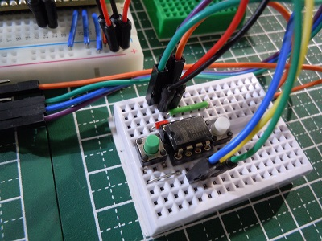
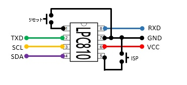
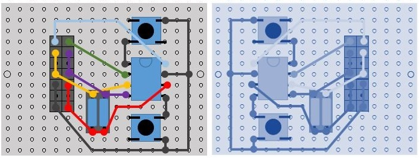

# LPC810 UART-I2Cブリッジモジュール  
     
##概要  
シリアル通信(UART)でI2C接続機器(I2Cスレーブ)を制御するためのモジュールです。  
制御用に8ピンDIPマイコン(通称 どんぐり) LPC810を利用してます。 

##特徴  
- UART経由で簡易コマンドを使ってI2Cスレーブへのデータ送信および受信を行うことが出来ます。  
- 送信するデータは可変長バイトデータ、および可変長半角文字列データに対応しています。  
- 受信データの出力はHEX形式、バイナリー形式、ダンプ表示（デバッグ用）を指定出来ます。  

##ハードウェア  
**回路図**  
  
**利用部品**  
- マイコンARM Cortex-M0(Flash 3KB, SRAM 1KB) LPC810(LPC810M021FN8) 1個   
- I2Cバス用プルアップ抵抗 2.2k～10kΩ 2本    
- タクトスイッチ 2個 リセット用x1、ISP用x1     

**ユーニバーサル基板実装例 表と裏**    
  

##開発環境  
本モジュール用プログラムの開発はWindows 10上にて行っています。  
開発には次のソフトウェアを利用しています。  
- LPC Xpresso v7.6.2  
- Switch Matrix tool  
- Flash Magic  

##UART-I2Cブリッジの使い方  
### インタフェース仕様  
- シリアル通信(UART)条件  
 - 通信速度 115200bps、8ビット、パリティ none、ストップビット 1bit  
 - 改行コード 受信・送信 CR+LF(ターミナルソフトからコマンドを実行する場合は、ローカルエコーをONにして下さい)  
- I2Cアドレス指定 8ビット  

