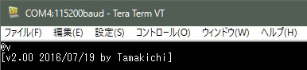
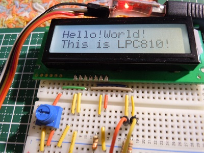
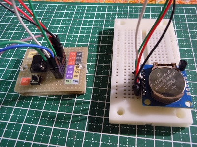
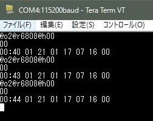
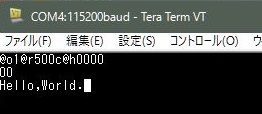
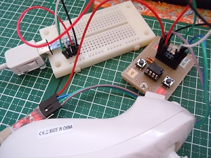
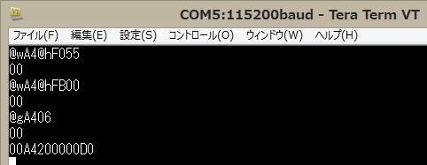

# LPC810 UART-I2Cブリッジモジュール  
     
##概要  
シリアル通信(UART)でI2C接続機器(I2Cスレーブ)を制御するためのモジュールです。  
制御用に8ピンDIPマイコン(通称 どんぐり) LPC810を利用してます。 

##特徴  
- UART経由で簡易コマンドを使ってI2Cスレーブへのデータ送信および受信を行うことが出来ます。  
- 送信するデータは可変長バイトデータ、および可変長半角文字列データに対応しています。  
- 受信データの出力はHEX形式、バイナリー形式、ダンプ表示（デバッグ用）を指定出来ます。  

##ハードウェア  
**回路図**  
  
VCCは3.3Vです。  

**利用部品**  
- マイコンARM Cortex-M0(Flash 3KB, SRAM 1KB) LPC810(LPC810M021FN8) 1個   
- I2Cバス用プルアップ抵抗 2.2k～10kΩ 2本    
- タクトスイッチ 2個 リセット用x1、ISP用x1     
- USB-UARTモジュール(3.3V)  1個 ※プログラム書き込みおよびPCからの利用時に必要 

**ユーニバーサル基板実装例 表と裏**    
  

##開発環境  
本モジュール用プログラムの開発はWindows 10上にて行っています。  
開発には次のソフトウェアを利用しています。  
- LPC Xpresso v7.6.2  
- Switch Matrix tool  
- Flash Magic  

##ファームウェア(プログラム)の書き込み方法  
UART2I2C/Release/にある**UART2I2C.bin**または**UART2I2C.hex**がプログラム本体です。    
書き込みツール**Flash Magic**等を使って書き込みを行って下さい。

書き込み方法は下記を参照して下さい。  
LPCZone：NXP LPCマイコン情報 - LPC810のフラッシュへの書き込みをシリアルインターフェースで行なう  
http://www.nxp-lpc.com/programming_note/note3.html  

##UART-I2Cブリッジの使い方  
### インタフェース仕様  
- シリアル通信(UART)条件  
 - 3.3V、通信速度 115200bps、8ビット、パリティ none、ストップビット 1bit  
 - 改行コード 受信・送信 CR+LF(ターミナルソフトからコマンドを実行する場合は、ローカルエコーをONにして下さい)  
- I2C接続条件
 - 3.3V、スレーブアドレス指定 8ビット  

### シリアル通信接続チェック  
@v[改行] を入力してバージョン情報が正しく表示出来ることを確認します。  
(ローカルエコーON、送信・受信の改行コードをCR+LFに設定)  
  

### コマンド仕様  
  
コマンドの詳細については下記を参照下さい。  
(リンクを直接開くと一部文字化けするようです。ダウンロードして参照下さい)  
[ART-I2Cブリッジコマンド仕様書V100L2.pdf](/doc/UART-I2Cブリッジコマンド仕様書V100L2.pdf)  

エラーコード一覧  
   

### 利用例  
- 有機ＥＬキャラクタディスプレイモジュール(SO1602AWWB-UC-WB-U)  
  
送信コマンド  
    @c7800@h01020c01  
    @w78@h40@sThank you!  

- 液晶キャラクタディスプレイモジュール(ACM1602N1-FLW-FBW)  
  
送信コマンド  
    @cA000@h01380c  
    @cA080@sHello!World!  
    @cA000@hc0  
    @cA080@sThis is LPC810!  

- I2C RTCモジュール(DS1307+AT2432)    
  
 - DS1307 時刻設定  
   時刻 2015/05/17 (日) 21:00 を設定  
    @wd0@h000000210117051500  
     

 - DS1307 時刻読み出し  
    @o2@rd008@h00  
     
   (3回の実行で秒が更新されている)  

 - AT2432 EEPROMデータ書き込み  
    @wA0@h0000@sHello,World.  
     

 - AT2432 EEPROMデータ読み出し  
    @o1@ra00c@h0000  
     

- Wiiヌンチャク(黒ヌンチャク仕様)  
  
    @wA4@hF055  
    @wA4@hFB00    
    @gA406  
  

